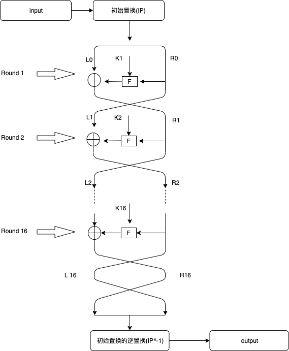
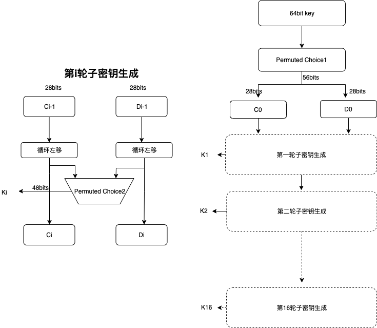

# DES-python
# DES算法的python实现
## DES加密原理
### 加密流程



### 子密钥生成过程


###F函数实现

###加解密过程合理性分析
加密和解密使用相同的密钥，相同的加密函数，唯一不同的是加解密使用的密钥顺序相反。可以通过下面的分析来证明加解密成立的合理性。("+"均表示异或操作)
```
使用Li与Ri表示加密过程的左右字段
对于每一轮加密有以下的递推式子
    Li=Ri-1
    Ri=Li-1+F(Ri-1,Ki)
可以考虑当解密时第一轮实际上对应上面的最后一轮因此有下列的递推式子
    Li-1=Ri
    Ri-1=Ri+F(Li,Ki)
这样十六轮后得到R0L0,然后交换位置得到L0R0,最后经过一轮IP^-1置换就回到了最初的明文。
```
## DES算法代码实现
### P盒置换函数
在DES算法中有很多处使用到了P置换，虽然有些还适当增加或者和删除bit但是实现原理相同，因此可以使用一个单独的函数来实现。如下所示
```
def permutation_by_table(block, block_len, table):
    '''block of length block_len permutated by table table'''
    # WRITE YOUR CODE HERE!
    result=0
    for x in table:
        bit=(block>>(block_len-x))&0x1
        result=(result<<1)|bit
    return result
```
值得注意的是在实现过程中特别容易忽略的一个细节，就是P table中的位置从0还是从1开始以及从高位到低位还是从低位到高位，这个细节即使搞错了你的加密算法依然会成功但是本质上就和你理解的DES算法有所出入。在这里我使用的从1开始表示以及从高位到低位来排序。
### 子密钥生成
这一部分主要是使用一个64比特的key通过多轮变换产生16组不同的48比特的的密钥。首先使用PC1盒置换使的64bit密钥在去除8、16、24、32、40、48、56、64位置的比特同时进行一轮置换
```
    PC1 = (
        57, 49, 41, 33, 25, 17, 9,
        1,  58, 50, 42, 34, 26, 18,
        10, 2,  59, 51, 43, 35, 27,
        19, 11, 3,  60, 52, 44, 36,
        63, 55, 47, 39, 31, 23, 15,
        7,  62, 54, 46, 38, 30, 22,
        14, 6,  61, 53, 45, 37, 29,
        21, 13, 5,  28, 20, 12, 4
        )
```
然后对产生的56bit拆分成左右两部分C0、D0进行16轮的子密钥生成，主要过程时Ci与Di分别等于Ci-1与Di-1经过循环左移一定的位数产生，然后Ki=PC2(CiDi),即CiDi重新组合后进过一轮PC2置换将56bit长度变为48比特子密钥输出。然后Ci,Di继续参与下一轮的密钥生成。
```
每一轮循环作左移位数
lrot_values = (1,1,2,2,2,2,2,2,1,2,2,2,2,2,2,1)
PC2置换表
PC2 = (
    14, 17, 11, 24, 1,  5,
    3,  28, 15, 6,  21, 10,
    23, 19, 12, 4,  26, 8,
    16, 7,  27, 20, 13, 2,
    41, 52, 31, 37, 47, 55,
    30, 40, 51, 45, 33, 48,
    44, 49, 39, 56, 34, 53,
    46, 42, 50, 36, 29, 32
)
```
最后重复16轮子密钥的生成过程，并将这16个密钥保存并返回
```
def generate_round_keys(C0, D0):
    '''returns dict of 16 keys (one for each round)'''
    round_keys = dict.fromkeys(range(0,17))
    lrot_values = (1,1,2,2,2,2,2,2,1,2,2,2,2,2,2,1)
 
    # left-rotation function
    lrot = lambda val, r_bits, max_bits: \
    (val << r_bits%max_bits) & (2**max_bits-1) | \
    ((val & (2**max_bits-1)) >> (max_bits-(r_bits%max_bits)))
    # initial rotation
    C0 = lrot(C0, 0, 28)
    D0 = lrot(D0, 0, 28)
    round_keys[0] = (C0, D0)
    # create 16 more different key pairs
    # WRITE YOUR CODE HERE!
    i=1
    for x in lrot_values:
        Ci_1=round_keys[i-1][0]
        Di_1=round_keys[i-1][1]
        Ci=lrot(Ci_1,x,28)
        Di=lrot(Di_1,x,28)
        round_keys[i]=(Ci,Di)
        i=i+1
    # round_keys[1] for first round
    #           [16] for 16th round
    # do not need round_keys[0] anymore, remove
    del round_keys[0]
    #form the keys from concatenated CiDi 1<=i<=16 and by apllying PC2
    # WRITE YOUR CODE HERE!
    merger = lambda c, d, bits: \
    (c & (2**bits-1))<<bits| \
    (d & (2**bits-1))
    for key in round_keys.keys():
        c=round_keys[key][0]
        d=round_keys[key][1]
        Ki=merger(c,d,28)
        Ki=permutation_by_table(Ki,56,PC2)
        round_keys[key]=Ki
    return round_keys
```
### S盒替换函数
在DES中S盒替换过程是由八个S盒组成，每一个S盒都将一个6比特数据变成4比特数据，替换规则为数据的第一位和第六位决定使用S盒的第几行，然后中间4位决定S盒中第几列数据。例如110100说明行为10=3，所以是第3行，然后1010=11说明是在第11列。值得注意的是这里的行和列都是从0开始计数的。
```
Sboxes = {
    0: (
        14,  4, 13,  1,  2, 15, 11,  8,  3, 10,  6, 12,  5,  9,  0,  7,
        0, 15,  7,  4, 14,  2, 13,  1, 10,  6, 12, 11,  9,  5,  3,  8,
        4,  1, 14,  8, 13,  6,  2, 11, 15, 12,  9,  7,  3, 10,  5,  0,
        15, 12,  8,  2,  4,  9,  1,  7,  5, 11,  3, 14, 10,  0,  6, 13
    ),
    1: (
        15,  1,  8, 14,  6, 11,  3,  4,  9,  7,  2, 13, 12,  0,  5, 10,
        3, 13,  4,  7, 15,  2,  8, 14, 12,  0,  1, 10,  6,  9, 11,  5,
        0, 14,  7, 11, 10,  4, 13,  1,  5,  8, 12,  6,  9,  3,  2, 15,
        13,  8, 10,  1,  3, 15,  4,  2, 11,  6,  7, 12,  0,  5, 14,  9 
    ),
    2: (
        10,  0,  9, 14,  6,  3, 15,  5,  1, 13, 12,  7, 11,  4,  2,  8,
        13,  7,  0,  9,  3,  4,  6, 10,  2,  8,  5, 14, 12, 11, 15,  1,
        13,  6,  4,  9,  8, 15,  3,  0, 11,  1,  2, 12,  5, 10, 14,  7,
        1, 10, 13,  0,  6,  9,  8,  7,  4, 15, 14,  3, 11,  5,  2, 12 
    ),
    3: (
        7, 13, 14,  3,  0,  6,  9, 10,  1,  2,  8,  5, 11, 12,  4, 15,
        13,  8, 11,  5,  6, 15,  0,  3,  4,  7,  2, 12,  1, 10, 14,  9,
        10,  6,  9,  0, 12, 11,  7, 13, 15,  1,  3, 14,  5,  2,  8,  4,
        3, 15,  0,  6, 10,  1, 13,  8,  9,  4,  5, 11, 12,  7,  2, 14
    ),
    4: (
        2, 12,  4,  1,  7, 10, 11,  6,  8,  5,  3, 15, 13,  0, 14,  9,
        14, 11,  2, 12,  4,  7, 13,  1,  5,  0, 15, 10,  3,  9,  8,  6,
        4,  2,  1, 11, 10, 13,  7,  8, 15,  9, 12,  5,  6,  3,  0, 14,
        11,  8, 12,  7,  1, 14,  2, 13,  6, 15,  0,  9, 10,  4,  5,  3
    ),
    5: (
        12,  1, 10, 15,  9,  2,  6,  8,  0, 13,  3,  4, 14,  7,  5, 11,
        10, 15,  4,  2,  7, 12,  9,  5,  6,  1, 13, 14,  0, 11,  3,  8,
        9, 14, 15,  5,  2,  8, 12,  3,  7,  0,  4, 10,  1, 13, 11,  6,
        4,  3,  2, 12,  9,  5, 15, 10, 11, 14,  1,  7,  6,  0,  8, 13
    ),
    6: (
        4, 11,  2, 14, 15,  0,  8, 13,  3, 12,  9,  7,  5, 10,  6,  1,
        13,  0, 11,  7,  4,  9,  1, 10, 14,  3,  5, 12,  2, 15,  8,  6,
        1,  4, 11, 13, 12,  3,  7, 14, 10, 15,  6,  8,  0,  5,  9,  2,
        6, 11, 13,  8,  1,  4, 10,  7,  9,  5,  0, 15, 14,  2,  3, 12
    ),
    7: (
        13,  2,  8,  4,  6, 15, 11,  1, 10,  9,  3, 14,  5,  0, 12,  7,
        1, 15, 13,  8, 10,  3,  7,  4, 12,  5,  6, 11,  0, 14,  9,  2,
        7, 11,  4,  1,  9, 12, 14,  2,  0,  6, 10, 13, 15,  3,  5,  8,
        2,  1, 14,  7,  4, 10,  8, 13, 15, 12,  9,  0,  3,  5,  6, 11
    )
}
```
八个S盒一起工作将一个48比特的数分成八个部分例如B0B1B2B3B4B5B6B7,然后Bi使用第i个S盒进行替换。具体代码如下
```
def S_box(Ri):
    # split Ri into 8 groups of 6 bit
    # WRITE YOUR CODE HERE!
    B=[]
    for i in range(7,-1,-1):
        x=(Ri>>(i*6))&(0x3f)
        B.append(x)
    # interpret each block as address for the S-boxes
    # WRITE YOUR CODE HERE!
    for i in range(8):
        x=B[i]
        index=(((x>>5)&0x1)<<1)|(x&0x1)
        offet=(x>>1)&0xf
        B[i]=Sboxes[i][index*16+offet]
    # pack the blocks together again by concatenating
    # WRITE YOUR CODE HERE!
    Ri=0
    for i in range(8):
        x=B[i]
        Ri=(Ri<<4)|(x&0xf)
    return Ri
```
### F函数实现
F函数的功能是输入一个32比特Ri，以及48比特密钥Ki，先对Ri使用E table进行置换得到一个48比特数据表示为E(Ri)
```
E  = (
    32, 1,  2,  3,  4,  5,
    4,  5,  6,  7,  8,  9,
    8,  9,  10, 11, 12, 13,
    12, 13, 14, 15, 16, 17,
    16, 17, 18, 19, 20, 21,
    20, 21, 22, 23, 24, 25,
    24, 25, 26, 27, 28, 29,
    28, 29, 30, 31, 32, 1
)
```
然后使用Ki与上面产生48bit数据进行异或操作表示为Ki+E(Ri),然后将其输入S-box进行替换得到32bit数据表示为S-box(Ki+E(Ri)),最后进过一轮P盒的置换即可。
```
P = (
    16,  7, 20, 21,
    29, 12, 28, 17,
    1, 15, 23, 26,
    5, 18, 31, 10,
    2,  8, 24, 14,
    32, 27,  3,  9,
    19, 13, 30,  6,
    22, 11, 4,  25
)
```
所以F函数的操作过程可以用一个式子表示：F(Ri,Ki)=P(S-box(Ki+E(Ri)))
```
def round_function(Ri, Ki):
    # expand Ri from 32 to 48 bit using table E
    Ri = permutation_by_table(Ri, 32, E)
    # xor with round key
    # WRITE YOUR CODE HERE!
    Ri = Ri^Ki
    Ri = S_box(Ri)
    # another permutation 32bit -> 32bit
    Ri=permutation_by_table(Ri, 32, P)
    return Ri
```
#### 加解密函数
加密函数主要操作是先根据上述过程生成子密钥，然后对明文使用IP进行初始置换
```
IP = (
    58, 50, 42, 34, 26, 18, 10, 2,
    60, 52, 44, 36, 28, 20, 12, 4,
    62, 54, 46, 38, 30, 22, 14, 6,
    64, 56, 48, 40, 32, 24, 16, 8,
    57, 49, 41, 33, 25, 17, 9,  1,
    59, 51, 43, 35, 27, 19, 11, 3,
    61, 53, 45, 37, 29, 21, 13, 5,
    63, 55, 47, 39, 31, 23, 15, 7
)
```
然后将生成IP块分成L0和R0左右各一半，接着使用刚才生成子密钥进行16轮的加密操作，最后生成L16R16,然后再交换左右位置变为R16L16然后经过最后一轮的IP^-1(初始置换的逆置换)
```
IP_INV = (
    40,  8, 48, 16, 56, 24, 64, 32,
    39,  7, 47, 15, 55, 23, 63, 31,
    38,  6, 46, 14, 54, 22, 62, 30,
    37,  5, 45, 13, 53, 21, 61, 29,
    36,  4, 44, 12, 52, 20, 60, 28,
    35,  3, 43, 11, 51, 19, 59, 27,
    34,  2, 42, 10, 50, 18, 58, 26,
    33,  1, 41,  9, 49, 17, 57, 25
)
```
最后输出的就是密文，这里在实现过程中还有一个值得注意的是由于加解密只是密钥顺序不同所以，我们给加密函数加了一个参数表示是否为解密过程，如果是则将子密钥顺序调转即可实现加解密操作。
```
#加密函数
def encrypt(msg, key, decrypt=False):
    # permutate by table PC1
    key = permutation_by_table(key, 64, PC1) # 64bit -> PC1 -> 56bit
    # split up key in two halves
    # WRITE YOUR CODE HERE!
    C0 = (key>>28)&0xfffffff
    D0 = key&0xfffffff
    # generate the 16 round keys
    round_keys = generate_round_keys(C0, D0) # 56bit -> PC2 -> 48bit
    msg_block = permutation_by_table(msg, 64, IP)
    # WRITE YOUR CODE HERE!
    L0 = (msg_block>>32)&0xffffffff
    R0 = msg_block&0xffffffff
    # apply round function 16 times (Feistel Network):
    L_last = L0
    R_last = R0
    # WRITE YOUR CODE HERE!
    if decrypt:
        for i in range(16,0,-1):
            tmp=L_last
            L_last=R_last
            R_last=round_function(R_last,round_keys[i])^tmp
    else:
        for i in range(1,17):
            tmp=L_last
            L_last=R_last
            R_last=round_function(R_last,round_keys[i])^tmp
    cipher_block=((R_last&0xffffffff)<<32)|(L_last&0xffffffff)
    # final permutation
    cipher_block = permutation_by_table(cipher_block, 64, IP_INV)
    return cipher_block
#解密函数
def decrypt(cipher_text, key):
    plain_text = encrypt(cipher_text, key, decrypt=True)
    return bytearray.fromhex(str(hex(plain_text))[2:]).decode()
```
## DES扩展
基于基本的DES我还稍微做了一些扩展,主要就是根据DES3以及ECB和CBC的加密原理在原来的代码基础上做了一些扩展，这三者的原理可以在网上找到这里不再赘述。
### Triple DES
主要思路就是输入一个 128 位的密钥并拆分成 k1、k2，然后对明文先使用 k1 加密然后将结果 在使用 k2 解密，最后将结果再一次使用 k1 加密即可得到密文。解密过程正好是上述过程的逆过程。
```
#DES3
##输入128位密钥key1|key2
def triple_des(key,msg,decrypt=False):
    key1=(key>>64)&(2**64-1)
    key2=key&(2**64-1)
    msg=encrypt(msg,key1,decrypt)
    msg=encrypt(msg,key2,not decrypt)
    msg=encrypt(msg,key1,decrypt)
    return msg
```
### ECB
```
#ECB模式
##输入字符串,输出加密结果的base64编码
def des_ecb_encrypt(msg,key):
    if(len(key) != 8):
        print("请输入八位字符串作为密钥")
        return
    key = int(binascii.hexlify(key.encode()) , 16)
    msg=create_padding(msg)
    y=len(msg)/8
    i=0
    ciphers=0
    while i<y:
        msg_block=int(binascii.hexlify(msg[i*8:(i+1)*8].encode()),16)
        ciphers=(ciphers<<64)|encrypt(msg_block,key)
        i=i+1
    return base64.b64encode(bytearray.fromhex(str(hex(ciphers))[2:])).decode()
##输入base64字符串,返回DES解密后的字符串
def des_ecb_decrypt(cipher,key):
    msg=base64.b64decode(cipher.encode())
    if(len(key) != 8):
        print("请输入八位字符串作为密钥")
        return
    key = int(binascii.hexlify(key.encode()) , 16)
    msg=int(binascii.hexlify(msg),16)
    plain_text=""
    while msg != 0:
        plain_text=decrypt(msg&(2**64-1),key)+plain_text
        msg=msg>>64
    return plain_text.split()[0]
```
### CBC
```
#CBC
##输入字符串,输出加密结果的base64编码
def des_cbc_encrypt(msg,key,iv):
    if(len(key) != 8):
        print("请输入八位字符串作为密钥")
        return
    if(len(iv) != 8):
        print("请输入八位字符串作为随机字符串iv")
        return
    key = int(binascii.hexlify(key.encode()) , 16)
    iv = int(binascii.hexlify(iv.encode()) , 16)
    msg=create_padding(msg)
    y=len(msg)/8
    i=0
    ciphers=0
    while i<y:
        msg_block=int(binascii.hexlify(msg[i*8:(i+1)*8].encode()),16)^iv
        c=encrypt(msg_block,key)
        ciphers=(ciphers<<64)|c
        iv=c
        i=i+1
    return base64.b64encode(bytearray.fromhex(str(hex(ciphers))[2:])).decode()
```
